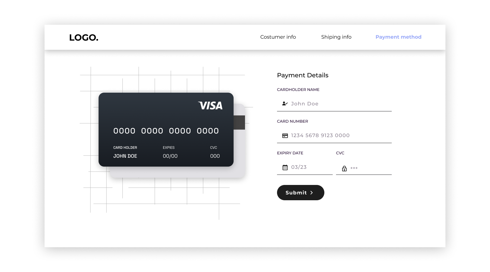

# Card Details Form

Este é um projeto dedicado a estudos que consiste em uma página web onde o usuário adiciona informações do seu cartão para compra. Os inputs são interativos, aparecendo na imagem do cartão de acordo com os dados do usuário.

## Tecnologias Utilizadas

- HTML
- CSS
- JavaScript

## Funcionalidades

- O usuário pode preencher os campos do formulário com as informações do seu cartão.
- A medida que o usuário preenche o formulário, as informações são refletidas na imagem do cartão.
- O usuário pode visualizar as informações do cartão na imagem ao lado do formulário.

#

